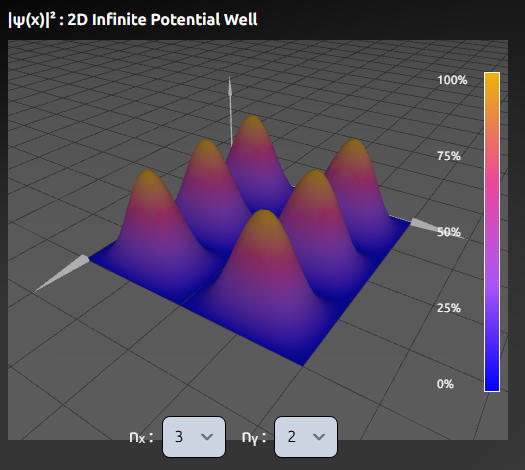

[![LinkedIn][linkedin-shield]][linkedin-url]
[![Stars][stars-shield]][stars-url]

<!-- PROJECT LOGO -->
 

  

<h3 align="center">Quantum Vision</h3>

  

    Quantum Vision is an advanced simulation project designed to make modern physics and quantum mechanics both accessible and engaging. By combining high-quality 2D and 3D visualizations, QuantumVision brings the fascinating, often abstract phenomena of the quantum scale into a tangible, interactive experience.
     
     
    <a href="https://www.qvisionsim.com/">View Project</a>
    &middot;
    <a href="https://github.com/alexfisher03/QuantumVision/issues/new?labels=bug&template=bug-report---.md">Report Bug</a>
  

<!-- TABLE OF CONTENTS -->

  
Table of Contents

  <ol>
    <li>
      <a href="#about-the-project">About The Project</a>
      <ul>
        <li><a href="#background">Background</a></li>
        <li><a href="#built-with">Built With</a></li> 
      </ul>
    </li>
    <li><a href="#roadmap">Roadmap</a></li>
    <li><a href="#gallery">Gallery</a></li>
    <li><a href="#license">License</a></li>
    <li><a href="#contact">Contact</a></li>
    <li><a href="#references">References</a></li>
  </ol>

<!-- ABOUT THE PROJECT -->
## About The Project

At its core, Quantum Vision simulates key processes from nuclear fusion to broader quantum mechanical behaviors. The project is built to serve both educational and exploratory purposes, allowing users to intuitively understand complex scientific concepts through real-time simulations.

### Background

During my time at the University of Florida, I took an introductory course in Modern Physics that I found incredibly engaging. But there was a real downside—there just weren't many good interactive visualizations to help make sense of the complex ideas. Even online, I struggled to find clear, practical examples that brought the concepts to life. This project was born out of that gap, aiming to offer visual tools that are both accessible and intuitive.

### Built With

* [![Svelte][Svelte.dev]][Svelte-url]
* [![Svelte-Kit][Svelte-Kit.dev]][Svelte-kit-url]
* [![TypeScript][TS.dev]][TS-url]
* [![JavaScript][JS.dev]][JS-url]
* [![Three.js][Three.dev]][Three-url]
* [![Tailwind][Tailwind.dev]][Tailwind-url]
* [![Vite][Vite.dev]][Vite-url]
* [![Figma][Figma.dev]][Figma-url]

(<a href="#readme-top">back to top</a>)

<!-- ROADMAP -->
## Roadmap

- [x] 1D Potential Well
- [x] 2D Potential Well
- [x] 3D Potential Well
- [x] Nuclear Fission
    - [x] Pause Functionality
- [x] Nuclear Fusion
    - [x] Pause Functionality
- [ ] Quantum Tunneling Simulation
- [ ] Mobile Optimization

(<a href="#readme-top">back to top</a>)

## Gallery

  
  
  
  
  

<!-- LICENSE -->
## License

This project is released under the Custom Proprietary License. All rights are reserved.

The source code is provided solely for viewing, educational, and personal reference purposes. You are not permitted to copy, modify, distribute, or claim this code as your own without explicit, prior written permission from the copyright holder.

For full details, please see the [LICENSE](LICENSE).

(<a href="#readme-top">back to top</a>)

## References

* [Libretexts Particle in a 1-Dimensional box](https://chem.libretexts.org/Bookshelves/Physical_and_Theoretical_Chemistry_Textbook_Maps/Supplemental_Modules_(Physical_and_Theoretical_Chemistry)/Quantum_Mechanics/05.5%3A_Particle_in_Boxes/Particle_in_a_1-Dimensional_box)
* [Libretexts Particle in a 2-Dimensional box](https://chem.libretexts.org/Bookshelves/Physical_and_Theoretical_Chemistry_Textbook_Maps/Supplemental_Modules_(Physical_and_Theoretical_Chemistry)/Quantum_Mechanics/05.5%3A_Particle_in_Boxes/Particle_in_a_2-Dimensional_Box)
* [Libretexts Particle in a Three-Dimensional box](https://chem.libretexts.org/Courses/Pacific_Union_College/Quantum_Chemistry/03%3A_The_Schrodinger_Equation_and_a_Particle_in_a_Box/3.09%3A_A_Particle_in_a_Three-Dimensional_Box)
* [Libretexts Nuclear Fission](https://chem.libretexts.org/Courses/University_of_Missouri/MU%3A__1330H_(Keller)/21%3A_Nuclear_Chemistry/21.7%3A_Nuclear_Fission)
* [Libretexts Nuclear Fusion](https://chem.libretexts.org/Bookshelves/General_Chemistry/Map%3A_Chemistry_-_The_Central_Science_(Brown_et_al.)/21%3A_Nuclear_Chemistry/21.07%3A_Nuclear_Fusion)

(<a href="#readme-top">back to top</a>)

<!-- MARKDOWN LINKS & IMAGES -->
<!-- https://www.markdownguide.org/basic-syntax/#reference-style-links -->
[stars-shield]: https://img.shields.io/github/stars/alexfisher03/QuantumVision.svg?style=for-the-badge
[stars-url]: https://github.com/alexfisher03/QuantumVision/stargazers
[license-shield]: https://img.shields.io/github/license/github_username/repo_name.svg?style=for-the-badge
[license-url]: https://github.com/github_username/repo_name/blob/master/LICENSE.txt
[linkedin-shield]: https://img.shields.io/badge/-LinkedIn-black.svg?style=for-the-badge&logo=linkedin&colorB=555
[linkedin-url]: https://linkedin.com/in/fisheralexander03/
[Figma.dev]: https://img.shields.io/badge/Figma-F24E1E?style=for-the-badge&logo=figma&logoColor=white
[Figma-url]: https://www.figma.com/
[Svelte.dev]: https://img.shields.io/badge/Svelte-4A4A55?style=for-the-badge&logo=svelte&logoColor=FF3E00
[Svelte-url]: https://svelte.dev/
[Svelte-kit.dev]: https://img.shields.io/badge/SvelteKit-4A4A55?style=for-the-badge&logo=svelte&logoColor=FF3E00
[Svelte-kit-url]: https://svelte.dev/docs/kit/introduction
[TS.dev]: https://img.shields.io/badge/TypeScript-3178C6?style=for-the-badge&logo=typescript&logoColor=white
[TS-url]: https://www.typescriptlang.org/
[Three.dev]: https://img.shields.io/badge/Three.js-000000?style=for-the-badge&logo=three.js&logoColor=white
[Three-url]: https://threejs.org/
[Tailwind.dev]: https://img.shields.io/badge/Tailwind_CSS-grey?style=for-the-badge&logo=tailwind-css&logoColor=38B2AC
[Tailwind-url]: https://tailwindcss.com/
[Vite.dev]: https://img.shields.io/badge/Vite-646CFF?style=for-the-badge&logo=Vite&logoColor=white
[Vite-url]: https://vite.dev/
[JS.dev]:https://shields.io/badge/JavaScript-F7DF1E?logo=JavaScript&logoColor=000&style=flat-square
[JS-url]: https://developer.mozilla.org/en-US/docs/Web/JavaScript

